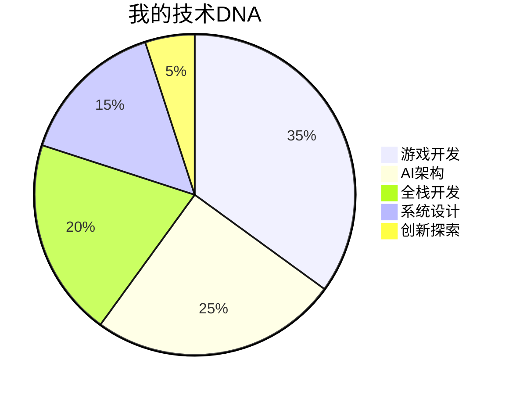

<div align="center">
  
</div>

---

<div align="center">
  
</div>

---

## 🦁 关于我

```yaml
name: Samuel
zodiac: 狮子座 ♌
passion: 游戏开发 & AI架构
motto: "代码如诗，架构如画"
location: 数字世界
languages: [中文, English, 代码语言]
```

> *"在代码的海洋中，我既是船长也是探险家。每一行代码都是对完美的追求，每一个架构都是对未来的想象。"*

---

## 🛠️ 技术栈

### 🎮 游戏开发


### 🤖 AI & 机器学习


### 💻 全栈开发


### ☁️ 云服务 & DevOps


---

## 📊 GitHub 统计

<div align="center">
  
</div>

<div align="center">
  
</div>

<div align="center">
  
</div>

---

## 🎯 当前专注

<div align="center">
  
| 🔥 游戏引擎优化 | 🧠 AI智能体开发 | 🏗️ 微服务架构 | 🎨 创意编程 |
|:---:|:---:|:---:|:---:|
| 让每一帧都如丝般顺滑 | 创造有灵魂的代码 | 构建可扩展的数字王国 | 用代码绘制艺术 |

</div>

<div align="center">
  
</div>

---

## 🏆 成就徽章

<div align="center">
  
</div>

---

## 🦁 狮子座特质

<div align="center">
  
</div>



---

## 📈 贡献热力图

<div align="center">
  
</div>

<div align="center">
  
</div>

---

## 🎮 游戏开发理念

> *"每一款游戏都是一个世界，每一个世界都需要一个建筑师。我用代码搭建桥梁，连接现实与虚拟，创造无限可能。"*

### 🎯 开发哲学

- **性能至上** - 60FPS是底线，120FPS是追求
- **用户体验** - 每一个像素都经过精心雕琢
- **创新驱动** - 不满足于现状，永远追求突破

---

## 🤖 AI 探索之旅

```python
class Samuel:
    def __init__(self):
        self.passion = "AI & Game Development"
        self.experience = "多年"
        self.zodiac = "狮子座"
    
    def code(self):
        return "创造奇迹"
    
    def innovate(self):
        return "突破边界"
    
    def inspire(self):
        return "点燃激情"

# 这就是我，一个永远在路上的技术探索者
```

---

## 🌟 项目亮点

<div align="center">

### 🎮 游戏项目

| 项目 | 描述 | 技术栈 |
|:---:|:---:|:---:|
| **3D游戏引擎** | 自研高性能渲染引擎 | Unity, C#, Shader |
| **AI NPC系统** | 智能NPC行为树 | C#, AI, Behavior Tree |
| **多人联机架构** | 低延迟网络同步 | C#, Network, Socket |

### 🤖 AI项目

| 项目 | 描述 | 技术栈 |
|:---:|:---:|:---:|
| **智能对话系统** | 多模态AI助手 | Python, OpenAI, NLP |
| **游戏AI优化** | 智能难度调节 | Python, ML, Game AI |
| **数据挖掘** | 玩家行为分析 | Python, Data Science, Analytics |

</div>

---

## 📞 联系我

<div align="center">
  <a href="https://github.com/Samuel521199">
    
  </a>
  <a href="https://github.com/Samuel521199?tab=repositories">
    
  </a>
</div>

<div align="center">
  
  
</div>

---

<div align="center">
  
</div>

---

<div align="center">
  
</div>

---

<div align="center">
  
### ⚡ 实时状态


</div>

---

<div align="center">
  
</div>

<div align="center">
  <sub>Made with ❤️ by Samuel | 狮子座 ♌ | 2024</sub>
</div>
